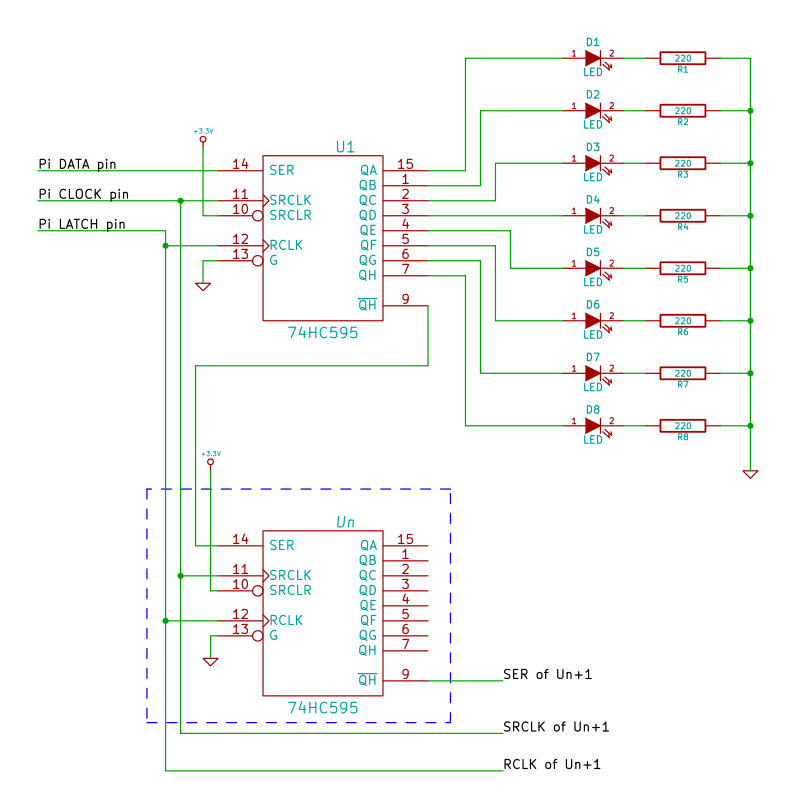

#RPiShift

A python module for interfacing a 595 shift register with the Raspberry Pi

#Installation
You can install RPiShift one of two ways:
* Using **pip**:
```sh
$ pip install RPiShift
```

* Using setup.py and **setuptools**:
```sh
$ git clone git@github.com:kneitinger/RPiShift.git
$ ./setup.py install RPiShift
```
#Usage

## Hardware
To use RPiShift attach a 595 chip as indicated by the following schematic 

## Software

###Initializing the module
If the 595 is only device attached to the GPIO pins of the Raspberry Pi, begin
by importing the RPiShift module
```python
import RPiShift
```
After that call the shiftr initialization function to configure the pins:
```python
# Argument list
# Shiftr(dataPin, clockPin, latchPin, [chainLength], [boardMode])
# Args in [] are optional and default to 1 and GPIO.BOARD respectively
shift = RPiShift.Shiftr(11,13,15)
```
**NOTE:** When using the RPi.GPIO library with other buttons, motors, etc. at
the same time as the RPiShift library, be sure to pass the board mode (GPIO.BCM
or GPIO.BOARD) to ensure that there are not conflicting pin mappings.

###Writing bytes
To write a byte to the shift register simply call the writeByte method with the
desired value to write:
```python
# Turn on all LEDs (with only one 595 in the chain)
shift.writeByte(0xFF)
# Turn off all LEDs
shift.writeByte(0x00)
# Display a binary 37 (00100101)
shift.writeByte(37)
# Display every 4 LEDs in a 4-chain circuit
shift.writeByte(0x0F0F0F0F)
```
Currently there is no bounds checking, so be sure you're writing the correct
amount of digits for the length of your chain: 2 hex digits or 8 binary
digits per 595.

###Writing single pins
To write a value to a single pin, call the writePin method with the desired pin
(beginning at 0) and value (0 or 1):
```python
# Blink each pin in order
for i in range (8*shift.CHAIN):
    shift.writePin(i,1)
    time.sleep(.125)
    shift.writePin(i,0)
```

###Toggling a pin
To toggle the state of a single pin, call the togglePin method with the desired
pin to change
```python
# Turn on every other pin
shift.writeByte(0x55)
# Toggle 0b01010101 to 0b10101010
while True:
    for i in range(8):
        shift.togglePin(i)
        time.sleep(.125)
```

###Pushing single bits ala FIFO queue
With the pushBit and writeLatch functions, you can treat the 595(s) as a FIFO
queue, pushing single bits into the register and triggering the update with
writeLatch.
For example, we can push a 1, write the latch, push a 0 seven times, and get a
scrolling effect:
```python
for i in range(64):
    shift.pushBit(((i+1)%8==0)
    shift.writeLatch()
    time.sleep(.1)
```

###Cleanup practices
It is a good idea to call the cleanup function at the end of the program, but
there are two special cases to watch for.
* Keyboard Interrupts
To ensure that keyboard interrupts are taken care of gracefully, put your main
function in a `try:` block and cleanup the pins if the KeyboardInterrupt is
raised:
```python
try:
    mainFunc()
except KeyboardInterrupt:
    shift.cleanup()
    exit(1)
```
* When used with RPi.GPIO or other output libraries
If you are using another GPIO module such as RPi.GPIO, wiringpi, etc.; be
mindful that calling cleanup may interact with the output of other modules.
While this should not be an issue if called at the end of the program, care
should be taken in regards to calling cleanup mid-program.

## Further info
For more information, check out the example programs and the source code.
If you have any questions, comments or feedback feel free to email me at
[kylejkneitinger@gmail.com](kylejkneitinger@gmail.com).  Happy hacking!
